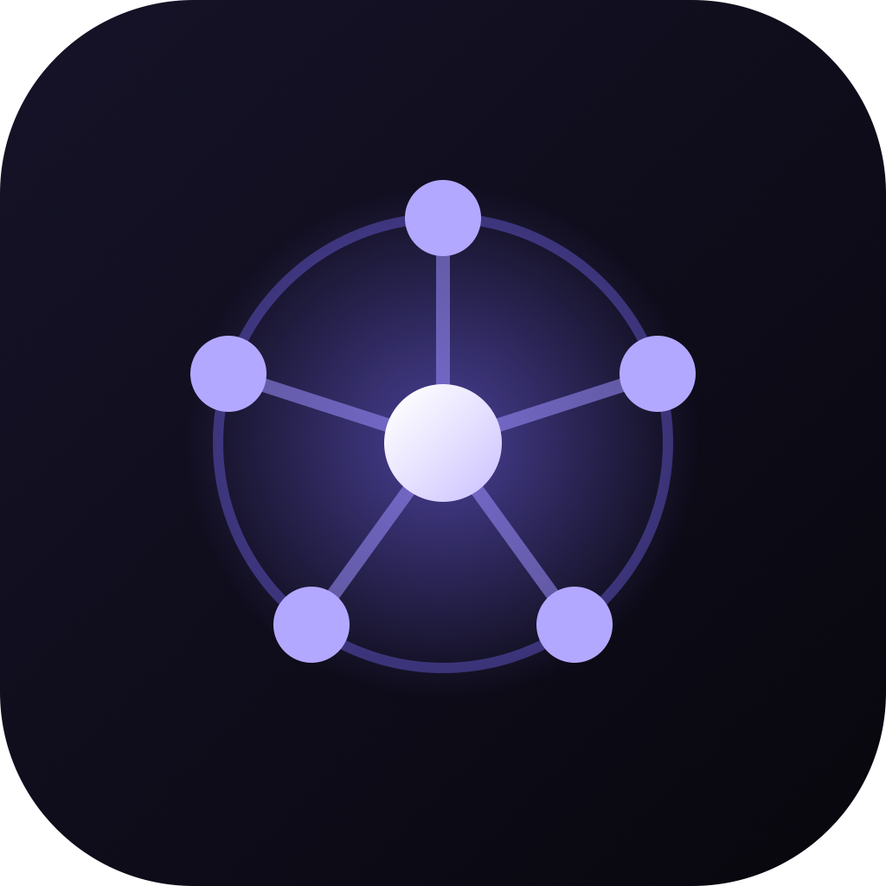

<p align="center">
  
</p>

<h1 align="center">Orkestra</h1>

<p align="center">
  Um canvas para orquestrar agentes de IA de código — terminais reais que conversam entre si.
</p>

<p align="center">
  
  
  
</p>

---

O **Orkestra** trata vários agentes de IA como uma equipe: cada um roda num **terminal de verdade** dentro de um canvas infinito, ganha um nome e um papel, e pode falar com os outros — tudo coordenado de dentro do próprio terminal, pela CLI `orq`.

Ele **não embute nenhuma IA própria**: orquestra as ferramentas de linha de comando que você já usa (Claude Code, Codex, Gemini) ou um shell puro.

## ✨ Destaques

- 🖥️ **Terminais reais** no canvas — arraste, redimensione, conecte. E continuam rodando quando você troca de projeto.
- 🤝 **Agentes que conversam** — `orq ask "Dev" "..."` envia uma mensagem ao terminal de outro agente; um agente líder pode recrutar e coordenar a própria equipe.
- 🎭 **Papéis prontos** (Líder, Dev, Revisor, Testador) e um modal de criação de terminal com atalhos.
- 🌗 **Tema claro/escuro**, 📝 **notas em Markdown**, 🔗 **conexões tipadas**, ⌨️ **command palette** (`Cmd/Ctrl+K`).
- 🌐 **Portais** — um navegador embutido, dirigível por comando, com sessões isoladas (multi-conta).
- 🗂️ **Árvore de arquivos** com status git, e **arrastar arquivos** do Finder direto para o terminal.
- 🛰️ **Terminais SSH remotos** e 🔒 **seguro por construção** — renderer isolado, servidor de orquestração só em `127.0.0.1` com token, SSH sem injeção de shell.

## 🚀 Rodar

```bash
npm install
npm run dev
```

Para gerar instaladores (macOS · Windows · Linux), veja [`docs/BUILD.md`](docs/BUILD.md).

## 🎛️ A CLI `orq`

Todo terminal criado no canvas recebe o comando `orq`, que conversa com o app para ver e controlar o resto do canvas:

```
list · ask · check · note · recruit · connect · dismiss · portal
```

Exemplo — um agente líder monta a própria equipe sem sair do terminal:

```bash
orq recruit "Dev" claude "implementar a feature"
orq ask "Dev" "comece pela camada de dados"
```

## 🛠️ Como é feito

Electron · React · [React Flow](https://reactflow.dev/) · [xterm.js](https://xtermjs.org/) · node-pty. O processo principal concentra tudo que é sensível (os shells, os arquivos, o servidor de orquestração); o renderer roda isolado (sandbox). Testado com Vitest.

## 👤 Autoria

Criado por **Felipe Abreu** — [@felipeabreu2](https://github.com/felipeabreu2).

Projeto open-source: você pode usar, estudar, modificar e distribuir livremente. A licença MIT pede apenas que o **aviso de copyright e o crédito ao autor sejam mantidos** em cópias e trabalhos derivados.

## 📄 Licença

[MIT](LICENSE) © 2026 Felipe Abreu
