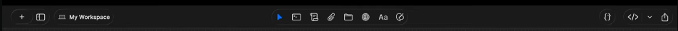
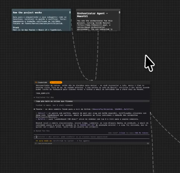
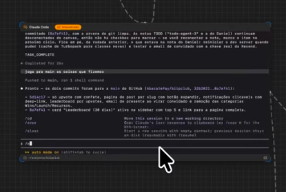
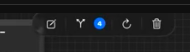
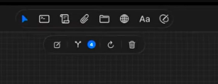
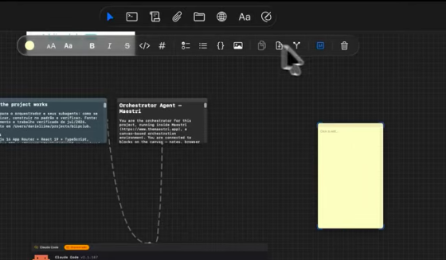
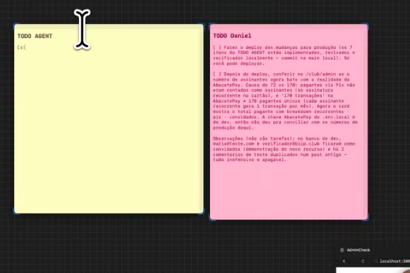

Copuar o design e layout exatamente igual da imagens:

## Feature 01 — Barra de ferramentas

Deve copiar exatamente o layout da barra do menu superior, o que tem na imagem é: No canto esquerdo, a gente tem:
- Um botão de mais, que é basicamente para a gente adicionar um novo projeto.
- Um ícone para ocultar e exibir o menu lateral.
- Em "My workspace", a gente pode colocar o nome da pasta. No menu central, a gente tem alguns ícones:
- Para a gente conseguir navegar normalmente, arrastar na nossa workspace ali dentro.
- Para criar um novo terminal.
- Para a gente criar uma nota.
- Para a gente anexar um arquivo dentro do nosso projeto.
- Para anexar uma pasta, acredito eu.
- Para anexar um site, o Nidia faz ele atualmente.
- Para a gente colocar um texto dentro do nosso sistema ali, para a gente criar uma nota, um texto ali dentro.
- Para a gente desenhar. Lá no canto direito, a gente tem:
- Um link para abrir o código da nossa pasta. Pode ser pelo VS Code, pelo cursor. Aí também, por enquanto, a gente pode deixar somente esse.

## Feature 02 — UI e Animações

E volta a falar para copiar exatamente como está o novo sistema, tá? Se você reparar na imagem, a gente tem dois quadrados na parte superior e o quadro de notas, tá? Onde, se você reparar, está informatado em Markdown, onde o usuário consegue deixar negrito ou sublinhado e tudo mais, tá? Além disso, no terminal que está na parte inferior, você consegue ver o design dele, que ele tem algo do Code Code, tem destaque ali que ele tá rodando. Também, outra coisa: animações dos pontilhados. Eu quero os pontilhados como se fosse uma corda, né? Se a gente arrasta esse card ligado, ele fica balança, cria uma animação, tá? Seguindo esse formato de pontilhado um pouquinho mais grosso e comprido

## Feature 03 — Melhorias de UI/UX e logica

Na parte do terminal, se você reparar na parte inferior, ele mostra qual página, qual pasta ele está rodando e mostra a rota da pasta. Também, se reparar, nos cantos, ele tem o ícone para você expandir, aumentar o terminal ou diminuir. Quero melhorar toda essa parte, o X e o Y dessa parte do terminal. Além disso, a gente tem que reparar no seguinte: no terminal, quando a gente interliga ele a uma informação, seja na parte superior ou esquerda do terminal, ele deve fazer a leitura das informações antes de iniciar uma resposta. Por que? Vou dar um exemplo: a gente coloca um prompt para esse agente do Claude, então ele deve fazer a leitura e seguir exatamente esse prompt e ter um contexto antes, entende? Quando a gente liga no lado direito inferior, vou dar um exemplo. O site que a gente interligou quer dizer que o agente tem acesso a esse note que a gente interligou ao site e consegue fazer navegação e utilizar ele direto pelo orkestra

## Feature 04 — Melhorias e botões ligados ao terminal

A gente clica em um terminal e a gente abre esse menu na parte superior, embaixo da nave barra superior. Aparecem mais esses quatro ícones de botões:
1. Para trocar o nome do terminal.
2. Para mostrar a quantidade de itens ligados a esse terminal.
3. Para reverter alguma ação que a gente tem feito, se for trocar o nome, ligar alguma coisa relacionada a esse terminal.
4. Para apagar.

## Feature 05 — Barra de ferramentas do terminal

O usuário clica no terminal. Basicamente, fica nesse formato: os botões que vão aparecer. Ou seja, na parte superior tem os botões normais do nosso navbar, que sempre vão ficar, e na parte inferior vai abrir quando o usuário clicar no terminal.

## Feature 06 — Barra de ferramentas da Nota

O usuário clica na nota, clica aqui em "Bloco de notas" e deve abrir esse menu lá embaixo do menu principal superior, onde consegue:
- personalizar a nota
- trocar cor
- trocar fonte
- colocar negrito
- colocar forma turista, etc.  Copiei exatamente como está na imagem e todas as suas funcionalidades!

## Feature 07 — Barra de ferramentas

Quando usuario trocar a cor da Nota deve ficar assim a formatacao.