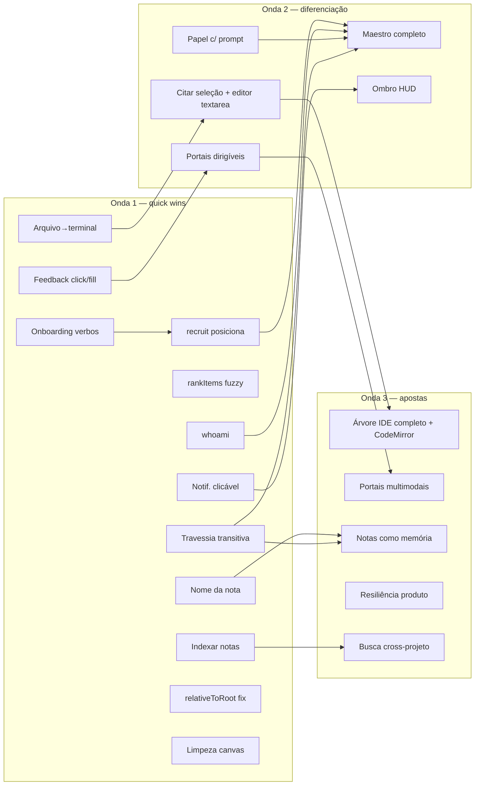

# ROADMAP — Desenvolvimento completo do Orkestra

> **Doc-mestre do planejamento.** Sequencia o desenvolvimento das 13 funcionalidades mapeadas na
> [análise 360°](../analise-maestri-360/README.md) rumo a um produto completo e diferenciado.
> Cada funcionalidade tem um plano de implementação detalhado (nível TDD) linkado abaixo.
> Fonte estratégica: [`ALEM-DO-MAESTRI-oportunidades.md`](../analise-maestri-360/ALEM-DO-MAESTRI-oportunidades.md).
> Data: 2026-07-15.

---

## 1. Princípio central

**O encanamento do Orkestra está à frente do produto/UX.** Servidor de orquestração, `AgentBus`,
detecção de ociosidade, cordas tipadas, persistência atômica e hardening de segurança já estão
prontos e testados. O trabalho pela frente é quase todo de **produto/UX**: *expor* valor que a base
já sustenta. Isso torna a estratégia clara — **destravar** antes de **construir**.

Onde o Orkestra **já supera** o Maestri (não regredir): continuidade de PTY com re-attach + scrollback
na troca de projeto; sinal "generating" por conteúdo da tela (border-beam); roteamento de resposta
imune a foco (`orq ask --wait`); hardening de portal (SEC-3/SEC-6); validação SSH anti-injeção;
persistência atômica com fsync + self-heal; isolamento de crash por nó (ErrorBoundary);
find-replace + cores nas notas; escopo de projeto fail-closed no servidor.

---

## 2. Estado das 13 funcionalidades

| # | Funcionalidade | Plano | Status | Ondas | Achado-chave |
|---|----------------|-------|--------|-------|--------------|
| 1 | O Canvas | [canvas.md](canvas.md) | 🟢 paridade alta | 1–2 | Falta `⇧T` grade, renomear grupo, navegação por conexão, Configurações |
| 2 | Batuta Search | [batuta-search.md](batuta-search.md) | 🟡 núcleo | 1, 3 | `rankItems` fuzzy/multi-palavra/sem-acento (TDD puro, maior retorno isolado) |
| 3 | Terminais e Agentes | [terminais-agentes.md](terminais-agentes.md) | 🟢 forte | 2–3 | **Gap crítico:** papel que **injeta instruções** (`prompt` no `Role`) |
| 4 | Notas | [notas.md](notas.md) | 🟡 modelo diferente | 1, 3 | Nome personalizado; rumo a `.md` em disco (memória durável) |
| 5 | Conexões | [conexoes.md](conexoes.md) | 🟢 alta | 1–2 | **Travessia transitiva** da cadeia de notas no `/context` |
| 6 | Modo Maestro | [modo-maestro.md](modo-maestro.md) | 🟡 encanamento pronto | 1–2 | Onboarding dos verbos; `recruit` posiciona/auto-conecta; `whoami`; toggle/gating |
| 7 | Árvore de Arquivos | [arvore-arquivos.md](arvore-arquivos.md) | 🟡 read-only | 1–3 | Arrastar arquivo→terminal; bug `relativeToRoot`; citar seleção + editor `textarea` (CodeMirror → Onda 3) |
| 8 | Portais | [portais.md](portais.md) | 🟢 sólida | 1–3 | Feedback `click/fill`; `screenshot`; `orq portal create`; pipelines web sem MCP |
| 9 | Solução de Problemas | [solucao-problemas.md](solucao-problemas.md) | 🟡 resiliência forte | 3 | Hibernação de projeto; export de diagnóstico; limite de memória por terminal |
| 10 | Ombro | [ombro.md](ombro.md) | 🟡 metade sem-LLM | 1–2 | Notificação clicável; HUD de atenção; detector "travou vs terminou" |
| 11 | SSH Remoto | [ssh-remoto.md](ssh-remoto.md) | 🟢 transporte pronto | 2 | Drag-drop via `scp`; feedback de conexão (túnel reverso = futuro) |
| 12 | Andares (Floors) | [andares-floors.md](andares-floors.md) | ⚫ removido | — | Reintroduzir só sob demanda (orquestração paralela) |
| 13 | Rotinas | [rotinas.md](rotinas.md) | ⚫ removido | — | Reintroduzir só sob demanda (escopado por projeto) |

**Legenda:** 🟢 paridade alta · 🟡 parcial / modelo diferente / encanamento pronto · ⚫ removido por decisão.

---

## 3. Roteiro em 3 ondas

Sequência pragmática: **destravar** o valor barato → **diferenciar** → **apostar grande**.
Cada item aponta para a tarefa correspondente no plano da funcionalidade.

### 🌊 Onda 1 — Quick wins (destravar a infra pronta)

Objetivo: transformar "encanamento à frente do produto" em valor visível com esforço mínimo.
Todos reaproveitam código já testado. **Ordem de arranque recomendada: 1 → 2 → 3/10 → 4 → 5.**

| Ordem | Quick win | Funcionalidade | Valor | Esforço |
|---|---|---|---|---|
| 1 | Documentar verbos de gerência no onboarding (`installOrq.ts`) | [modo-maestro](modo-maestro.md) | Alto | Mínimo |
| 2 | Notificação clicável (foca janela + enquadra nó) | [ombro](ombro.md) | Alto | Baixo |
| 3 | `rankItems` fuzzy + multi-palavra + sem-acento | [batuta-search](batuta-search.md) | Alto | Baixo |
| 4 | Arrastar arquivo da árvore → terminal | [arvore-arquivos](arvore-arquivos.md) | Alto | Baixo |
| 5 | Travessia transitiva da cadeia de notas no `/context` | [conexoes](conexoes.md) | Alto | Baixo |
| 6 | `recruit` posiciona abaixo + auto-conecta | [modo-maestro](modo-maestro.md) | Alto | Baixo-Médio |
| 7 | `orq whoami` / `list --me` | [modo-maestro](modo-maestro.md) | Médio-Alto | Baixo |
| 8 | Feedback de sucesso em `portal click/fill` | [portais](portais.md) | Médio-Alto | Médio* |
| 9 | Indexar o corpo das notas na busca | [batuta-search](batuta-search.md) · [notas](notas.md) | Alto | Baixo |
| 10 | Nome personalizado da nota (`data.name` + renomear) | [notas](notas.md) | Alto | Baixo |
| 11 | Corrigir `relativeToRoot` (`git rev-parse --show-prefix`) | [arvore-arquivos](arvore-arquivos.md) | Médio | Baixo |
| 12 | Limpeza de paridade do Canvas (`⇧T`, renomear grupo, auto-dissolver) | [canvas](canvas.md) | Médio | Baixo |

> \* **Correção do plano de Portais:** a premissa "só propagar o booleano" da análise era enganosa — a ponte main→renderer é unidirecional (sem canal de volta). O feedback exige **construir** um round-trip (id de correlação + canal `portal:result` + timeout, espelhando o `askWait`), então o esforço real é **Médio**, não Baixo. Ainda é Onda 1, mas dimensione com isso em mente.

*Resultado esperado:* grande parte do valor latente da orquestração e da busca fica exposta,
reaproveitando código testado.

### 🌊 Onda 2 — Diferenciação (montar produto sobre a base)

Objetivo: converter as alavancas em recursos que já superam o Maestri.

- **Papéis ricos** — papel-com-`prompt` (gap crítico) → `role.json` portátil + "Descobrir Responsabilidades" + `orq role`. → [terminais-agentes](terminais-agentes.md)
- **Modo Maestro completo** — toggle + gating, `reassign` mid-task, template de esquadrão (Dev+Revisor+Testador+Docs), aresta `agent` "carregada" (contexto roteado por conexão). → [modo-maestro](modo-maestro.md) + [conexoes](conexoes.md)
- **Ombro evoluído** — HUD de atenção, detector "travou vs terminou", prévia da última linha, agregação anti-spam. → [ombro](ombro.md)
- **Portais dirigíveis** — `orq portal create` + `back/forward/reload/scroll` + `snapshot --html` + indicador "agente dirigindo". → [portais](portais.md)
- **Árvore, fase 1** — "citar seleção → agente conectado" + editor embutido `textarea` (escrita atômica com fsync, guard de traversal no main). O **CodeMirror foi movido para a Onda 3** por decisão (2026-07-16) — ver Onda 3, "Árvore como IDE colaborativo". → [arvore-arquivos](arvore-arquivos.md)
- **SSH** — drag-drop via `scp` + feedback de conexão. → [ssh-remoto](ssh-remoto.md)

### 🌊 Onda 3 — Apostas grandes (valor estratégico)

Objetivo: recursos que definem a categoria e exigem investimento dedicado.

- **Árvore como IDE colaborativo** — **editor CodeMirror** (realce de sintaxe, find/replace, ir-para-linha) + git de escrita (commit/branch/diff), modo Diff, watch de filesystem, citar diff → agente. O CodeMirror desceu da Onda 2 por decisão (2026-07-16): isolado custa ~1-2 dias e rende pouco sobre o `textarea` que já salva bem; junto do modo Diff, do git de escrita e do watch — que dependem do mesmo componente de edição — evita retrabalho. → [arvore-arquivos](arvore-arquivos.md)
- **Portais multimodais** — `screenshot` (`capturePage`) + `console`/rede → pipelines de automação web sem MCP. → [portais](portais.md)
- **Cadeia de notas como memória navegável** — UI de navegação + rumo a notas `.md` em disco (durável, versionável). → [notas](notas.md) + [conexoes](conexoes.md)
- **Resiliência como produto** — hibernação de projeto, export de diagnóstico, limite de memória por terminal, painel de saúde dos agentes. → [solucao-problemas](solucao-problemas.md)
- **Busca cross-projeto** — indexar e saltar entre projetos. → [batuta-search](batuta-search.md)
- **Sob demanda concreta** — reintroduzir [Floors](andares-floors.md) escopado por projeto, túnel reverso SSH e LLM local do Ombro — **apenas** se orquestração paralela cross-máquina ou privacidade on-device virarem prioridade.

---

## 4. Dependências entre as ondas

**Leituras da dependência:**
- **Papel-com-`prompt`** (Onda 2) é pré-requisito conceitual do **Maestro completo** — sem papel comportamental, o "esquadrão" é só cosmético.
- **Onboarding dos verbos** (#1, Onda 1) destrava tudo do Maestro para o agente — fazer **primeiro**.
- **Travessia transitiva** (#5) é a base tanto do Maestro (contexto roteado) quanto da **memória de notas** (Onda 3).
- **Feedback `click/fill`** → **Portais dirigíveis** → **Portais multimodais** é uma trilha contínua.
- **Arquivo→terminal** → **citar seleção + editor `textarea`** → **Árvore IDE (com CodeMirror)** é a outra trilha contínua. O CodeMirror é o começo da etapa de Onda 3, não o fim da de Onda 2.

---

## 5. O que NÃO perseguir agora

Para focar energia (detalhado em [ALEM-DO-MAESTRI §5](../analise-maestri-360/ALEM-DO-MAESTRI-oportunidades.md)):

- **Andares/Floors** e **Rotinas/cron** — removidos por decisão (Fase 16). Reintroduzir só sob demanda concreta, sempre **escopado por projeto**. Ver [andares-floors.md](andares-floors.md) e [rotinas.md](rotinas.md).
- **Túnel reverso SSH** ("workspace SSH" completo) — alto esforço/risco; o transporte remoto já cobre os casos comuns. Ver [ssh-remoto.md](ssh-remoto.md).
- **Camada LLM do Ombro** (resumo/Q&A) — exige LLM local (lock-in de hardware) ou remoto; capturar todo o valor sem-LLM primeiro. Ver [ombro.md](ombro.md).
- **Polimentos de nicho** — i18n da Batuta, catálogo de temas de terminal, entrada "real" via CDP nos portais, modo Graph (`git log --graph`), grade de ícones com Quick Look. Fim da fila; nenhum bloqueia o fluxo central.

---

## 6. Como usar estes planos

Cada plano de funcionalidade segue o mesmo formato: **objetivo → estado atual verificado → gaps priorizados → tarefas TDD ordenadas → dependências/riscos → referências**. Cada tarefa traz os arquivos reais a tocar, o ciclo teste→implementação→verde e os critérios de aceite.

**Fluxo de execução recomendado por tarefa:**
1. Ler a tarefa no plano da funcionalidade.
2. Escrever o teste que falha (`npx vitest run <arquivo>`).
3. Implementar até ficar verde.
4. `npm run typecheck` + `npm run lint`.
5. Verificar critérios de aceite no app (`npm run dev`) quando a tarefa tiver superfície de UI.
6. Commit atômico por tarefa.

> **Nota sobre validade:** planos detalhados envelhecem conforme o código muda. Este ROADMAP é a
> **fonte viva** de sequência e prioridade; ao pegar uma funcionalidade, reconfira o "Estado atual"
> do plano dela contra o código antes de codar.

---

*Síntese em uma frase: o Orkestra já venceu a parte cara (infraestrutura segura, resiliente e
contínua) — o valor está em expor o Modo Maestro pronto, rotear contexto pelas conexões, tornar
papéis comportamentais e portáteis, e entregar o Ombro sem o lock-in de hardware do Maestri.*
