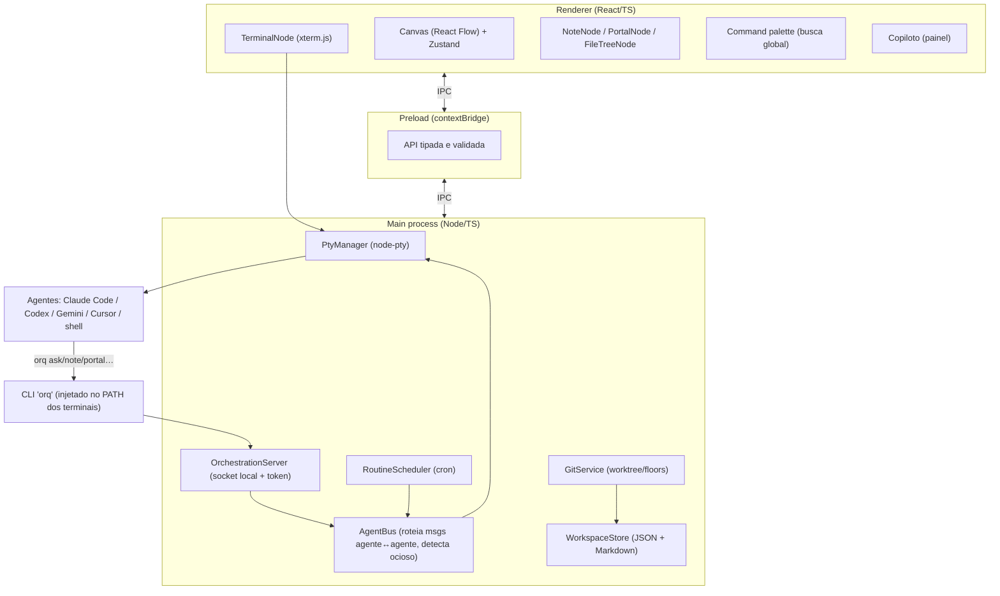

# Orkestra — Design / Spec

> **Codinome de trabalho:** "Orkestra" (provisório). Alternativas a decidir: Ensemble, Podium, Kanvas, Conductor. Não herdar a marca do Maestri (nomes "Maestri/Ombro/Batuta/Floors" são de terceiros).
> **Data:** 2026-07-09 · **Autor:** Felipe (com Claude Code) · **Status:** aprovado para implementação faseada.
> **Origem:** engenharia reversa do Maestri (`docs/reverse-engineering/themaestri-2026-07-09/`).

## 1. Visão geral
Orkestra é um **canvas de orquestração de agentes de código de IA**, empacotado como **app desktop Electron** e publicado como **open source gratuito**. Ele não é um agente nem tem IA própria: é a camada de canvas + orquestração *em volta* dos CLIs de agentes que o usuário já usa (Claude Code, Codex, Gemini CLI, Cursor e afins). Cada agente vive num terminal-nó num plano infinito; o usuário os conecta, dá papéis, e eles conversam e trabalham em paralelo.

É um **equivalente funcional** do Maestri (macOS nativo), reconstruído numa base cross-platform que roda na máquina do autor (Intel/macOS 12) e empacota para Mac/Windows/Linux. Onde fizer sentido, **diverge** do Maestri (não é cópia de UI, copy ou marca).

## 2. Objetivo e não-objetivos
**Objetivos**
- Rodar e gerenciar **múltiplos agentes de CLI** num canvas espacial, sem alt-tab.
- Permitir **comunicação e orquestração entre agentes** (um agente delega/pergunta a outro; um "maestro" recruta e coordena uma equipe).
- **Isolar trabalho em paralelo** via clones git (worktrees), com merge de volta.
- Ser **robusto, seguro e confiável**; código limpo e testado, pronto para publicar.

**Não-objetivos**
- Não é app nativo Swift/macOS 26; não usa Apple Foundation Models (o copiloto usará LLM plugável).
- Não tem licenciamento/venda (é grátis/open source) — sem Stripe, sem worker de licença.
- Não revende IA: o usuário traz seus próprios CLIs/credenciais (BYO-CLI).
- Não replicar identidade visual/copy/nomes do Maestri.

## 3. Constraints e premissas
- **Máquina de dev:** Intel x86_64, macOS 12.7.6, Node v24, **sem Rust** → Electron (não Tauri), toolchain 100% Node/TS.
- **Alvo de distribuição:** cross-platform (Mac/Windows/Linux) via empacotamento Electron.
- **Premissa BYO-CLI:** os agentes (Claude Code etc.) já estão instalados e autenticados pelo usuário.
- **Git obrigatório** para floors; usuário precisa de um repo git no workspace para isolamento.

## 4. Arquitetura
Três camadas do Electron + um CLI injetado nos terminais.

**Fluxo-núcleo (orquestração):** um agente roda `orq ask "Dev" "..."` dentro do seu terminal → o `orq` abre o socket local (autenticado por token) → `OrchestrationServer` valida e entrega ao `AgentBus` → o Bus escreve o prompt no PTY do terminal "Dev", monitora a saída e, ao detectar ociosidade, devolve a resposta ao chamador.

## 5. Módulos (unidades isoladas)
Cada módulo tem uma responsabilidade, uma interface e dependências claras.

| Módulo | Responsabilidade | Interface (resumo) | Depende de |
|---|---|---|---|
| `PtyManager` | criar/escrever/ler/matar PTYs; limite de RAM por terminal | `spawn(opts)→id`, `write(id,data)`, `onData(id,cb)`, `kill(id)` | node-pty |
| `AgentBus` | rotear mensagens agente↔agente; detectar "agente ocioso" | `ask(target,prompt)→Promise<text>`, `check(target)→text` | PtyManager |
| `OrchestrationServer` | socket local + auth por token; expõe verbos do `orq` | protocolo JSON (ver §7) | AgentBus, WorkspaceStore |
| `orq` (CLI) | cliente injetado nos terminais; traduz comandos→socket | binário/script Node | — |
| `GitService` | worktrees (floors), branch, land/merge, hooks | `createFloor`, `land(floor,target)`, `listFloors` | git |
| `WorkspaceStore` | persistir/carregar workspace (JSON) e notas (MD) | `load/save`, `patchNode`, `addNote` | fs |
| `RoutineScheduler` | agendar prompts (cron/intervalo), encadeamento | `create/enable/disable/run` | AgentBus |
| `CopilotService` | observar agentes; resumir; sugerir (LLM plugável) | `onAgentIdle→summary`, `summarizeNotes` | AgentBus, provider LLM |
| `Canvas` (renderer) | render de nós/edges, pan/zoom/foco, seleção | React Flow + Zustand store | preload API |
| `TerminalNode` | xterm.js ligado a um PTY | — | xterm.js |
| `PortalNode` | BrowserView/webview + ponte de automação | verbos `portal *` (ver §7) | Electron BrowserView |
| `CommandPalette` | busca global + ações (Pedir/Verificar/criar) | índice em memória | store |

## 6. Modelo de dados (persistência local, sem banco relacional)
- **Workspace** → arquivo JSON: `{ id, name, icon, workingDir, canvas:{zoom,pan}, nodes[], edges[], floors[], routines[], settings }`.
- **Node** (base): `{ id, type: terminal|note|portal|filetree|text|drawing, x, y, w, h, floorId, groupId? }`.
  - Terminal: `{ preset, roleId?, name?, attention:bool }` · Note: `{ filePath(.md), viewMode }` · Portal: `{ url, viewport, ua? }`.
- **Edge (conexão):** `{ id, source, target, kind: agent-agent|agent-note|agent-portal|note-note, style: rope|circuit }`.
- **Floor:** `{ id, name, branch, isGround, path(.orkestra/floors/<id>) }`.
- **Role:** `{ id, name, color, prompt }` (sidecar `role.json`, portátil).
- **Preset:** `{ id, name, command }` (ex.: `{name:"Claude Code", command:"claude"}`).
- **Routine:** `{ id, name, command, schedule, targetNodeId, enabled, count?, until? }`.
- Config global em `~/.orkestra/` (presets, roles, temas). Notas em Markdown reais no disco.

## 7. Protocolo de orquestração (`orq`) — o coração
CLI injetado no PATH de cada terminal (via rcfile/env). Fala com `OrchestrationServer` por socket local autenticado (token por sessão em env `ORKESTRA_TOKEN`). Verbos (espelham o essencial do Maestri, com liberdade de divergir):
- **Mensageria:** `list`, `ask "<alvo>" "<prompt>"`, `ask --batch '{...}'` (paralelo), `ask --raw`, `check "<alvo>"`.
- **Notas:** `note create|read|write|edit|delete`.
- **Portais:** `portal create|navigate|snapshot|click|fill|type|key|screenshot|evaluate|resize|close`.
- **Orquestração (papel maestro):** `recruit "<nome>" [--preset][--role][--floor][--command]`, `dismiss`, `connect`, `role list|assign`, `preset list`.
- **Floors:** `floor create [--branch][--existing-branch][--copy-ground]`, `floor list`, `floor land`.
- **Rotinas:** `routine create|list|enable|disable|run|delete`.
> Divergências planejadas do Maestri: nomes de verbos podem ser simplificados; protocolo documentado publicamente; permissões (quais verbos exigem "modo maestro") configuráveis.

## 8. Segurança e confiabilidade
- Renderer: `contextIsolation:true`, `sandbox:true`, `nodeIntegration:false`; toda a ponte via `preload` com API tipada e **validação de entrada** (zod).
- **OrchestrationServer autenticado por token** de sessão; socket restrito ao localhost/usuário. Sem token → sem controle do canvas.
- `portal evaluate` (JS arbitrário) e execução de comandos: escopo mínimo, logs, e confirmação para ações destrutivas.
- **Floors isolam via worktree** — nunca corrompem o repo principal; `land` usa merge com preview de conflitos.
- Limite de RAM por terminal (mata processo, mantém shell) para evitar que agentes derrubem o app.
- **TDD por módulo**; testes de integração para o fluxo de orquestração; e2e (Playwright) para os fluxos-chave.

## 9. Estratégia de testes
- **Unit (Vitest):** PtyManager, AgentBus (com PTY fake), GitService (repo temporário), WorkspaceStore, RoutineScheduler.
- **Integração:** `orq` ↔ OrchestrationServer ↔ AgentBus com um "agente" simulado (echo scriptado) para validar ask/check/detecção de ocioso.
- **e2e (Playwright para Electron):** criar terminal, conectar dois, delegar, criar floor e aterrissar.
- Cada fase só é "pronta" com seus testes verdes (ver §10).

## 10. Roadmap de fases
Cada fase entrega algo executável e testável. "Paralelizável" indica módulos independentes que podem ser construídos por agentes simultâneos.

| Fase | Objetivo | Entregável / Critério de pronto | Depende de | Paralelizável |
|---|---|---|---|---|
| **0 · Fundação** | scaffold Electron+electron-vite+React+TS; lint/format; Vitest; CI; empacotamento básico | app abre janela; `build` gera binário; CI verde | — | baixo |
| **1 · Terminal real** | xterm.js + node-pty; rodar um shell/agente | digitar num terminal e ver output; testes do PtyManager | 0 | médio (PtyManager ∥ TerminalNode) |
| **2 · Canvas multi-nó** | React Flow; criar/mover/redimensionar/zoom/pan/foco; N terminais | vários terminais no canvas, navegáveis | 1 | médio |
| **3 · Persistência + Workspaces** | salvar/carregar (JSON), diretório, ícones, múltiplos workspaces | fechar e reabrir mantém tudo | 2 | médio |
| **4 · Notas + Conexões** | NoteNode (markdown, raw/preview); edges tipados | notas editáveis; fios entre nós | 3 | alto (Note ∥ Edge ∥ persistência) |
| **5 · CLI de orquestração** | OrchestrationServer + `orq` (list/note/ask/check) + auth token | agente roda `orq note write` e aparece no canvas | 4 | médio |
| **6 · Comunicação agente↔agente** | AgentBus + detecção de ocioso; `ask`/`ask --batch` | um agente pergunta a outro e recebe resposta | 5 | baixo (núcleo de timing) |
| **7 · Modo Maestro + Roles/Presets** | recruit/dismiss/connect; presets (Claude/Codex/Gemini/Cursor); roles | maestro monta e coordena uma equipe | 6 | alto (presets ∥ roles ∥ recruit) |
| **8 · Floors (git)** | worktree por floor; land/merge; hooks; env vars | trabalhar isolado e aterrissar de volta | 3, 7 | médio |
| **9 · Portais** | BrowserView + automação (snapshot/click/fill/evaluate) | agente dirige um browser embutido | 5 | médio |
| **10 · Rotinas** | agendador (cron) + encadeamento `&&` | prompt agendado dispara sozinho | 6 | alto |
| **11 · Copiloto** | LLM plugável (API/Ollama) que observa e resume | resumo automático ao fim de tarefas | 6 | médio |
| **12 · Busca + Polish + Distribuição** | command palette; empacotamento cross-platform; auto-update; README; releases | **v1.0 pública** no GitHub | todas | alto |

## 11. Paralelização com agentes (como acelerar)
- Fases com "paralelizável: alto/médio" são construídas com **múltiplos subagentes/workflow**: um por módulo independente, seguindo TDD, com **verificação adversarial** ao fim de cada fase.
- Fases de núcleo delicado (6 · timing de ociosidade) são feitas com mais cuidado, single-thread, com testes de integração fortes.
- Cada fase = seu próprio ciclo spec-fino → plano → implementação paralela → verificação.

## 12. Riscos e mitigações
- **Detecção de "agente terminou"** (Fase 6) é o risco técnico central — heurística de prompt ocioso é frágil. Mitigar com: timeout + marcadores de fim + heurística de silêncio configurável; testes de integração com agentes simulados.
- **Isolamento de floors sem APFS:** `git worktree` cobre versionados; artefatos não versionados (node_modules) não são clonados instantaneamente. Mitigar: documentar; opção de `cp`/symlink seletivo.
- **Performance do canvas** com muitos terminais (xterm.js + React Flow). Mitigar: virtualização, `webgl` addon, hibernar nós fora de foco.
- **Segurança do socket de orquestração:** token obrigatório + escopo localhost.

## 13. Decisões em aberto (não bloqueiam a Fase 0)
- Nome definitivo do projeto e identidade visual.
- Motor de canvas: **React Flow** (recomendado, grafo de nós) vs. **tldraw** (desenho livre) — decidir na Fase 2.
- Provider default do copiloto (Ollama local vs. API) — decidir na Fase 11.
- Licença open source (MIT/Apache-2.0).

## 14. Referências
- Dossiê de engenharia reversa do Maestri: `../../../docs/reverse-engineering/themaestri-2026-07-09/` (arquitetura, CLI de orquestração, modelo de dados, fluxos).
